## Menuely iOS

Graduate thesis project iOS application created to modernize the process of menu creation and orders of hospitality facilities

## Description

The application enables login and registration of users and restaurants as separate entities. Restaurants have the ability to create, update and delete menus. Each menu can have its categories and each category can have products. By creating a menu QR codes are sent to the restaurants registered email address. The amount of QR codes should be equal to the number of tables a restaurant has. Users may be invited by restaurants to become a member of their working staff. Users may also scan QR codes to browse a restaurants offers list and create an order. Orders are marked as pending until a member of the restaurants staff accepts it. Both entities have the ability to extensively edit their profiles.

## Technologies

The application is created using SwiftUI and Combine. Its architecture was heavily inspired by Alexey Naumov's [post](https://nalexn.github.io/clean-architecture-swiftui/) about SwiftUI Clean Architecture where the application is split into 3 layers: presentation, business logic and data layers. Networking was done using [Alamofire](https://github.com/Alamofire/Alamofire) utilizing the power of Combine publishers. For dependancy injection [Resolver](https://github.com/hmlongco/Resolver) was used. 

The backend which this app is consuming can be found [here](https://github.com/hydro1337x/menuely-backend).

## Screenshots

### Entry

<table>
  <tr>
    <td>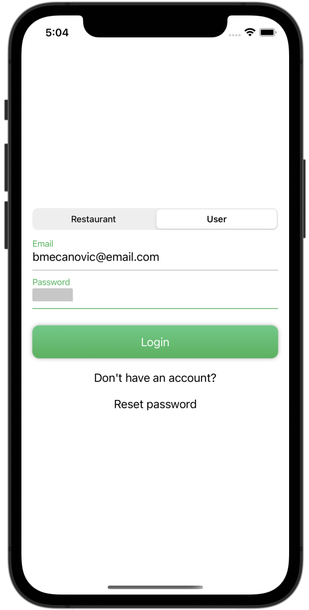</td>
    <td>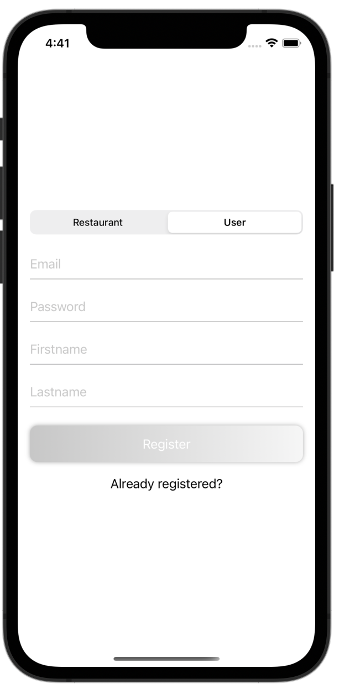</td>
    <td>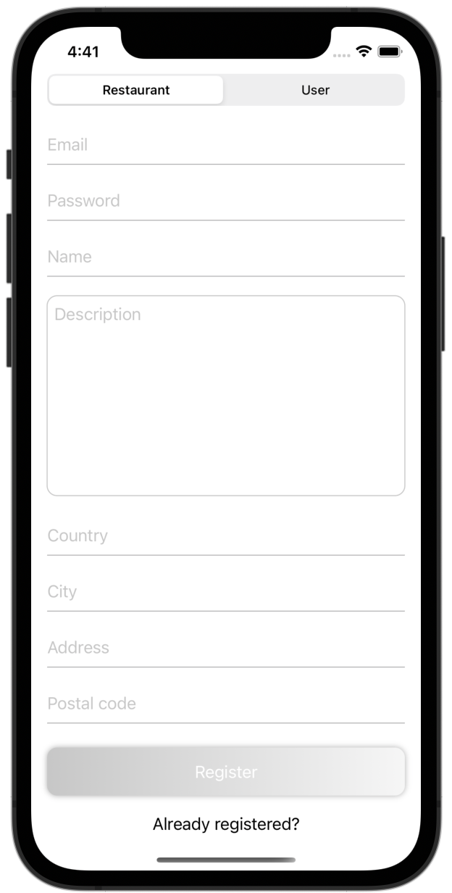</td>
  </tr>
</table>

### Offers

<table>
  <tr>
    <td>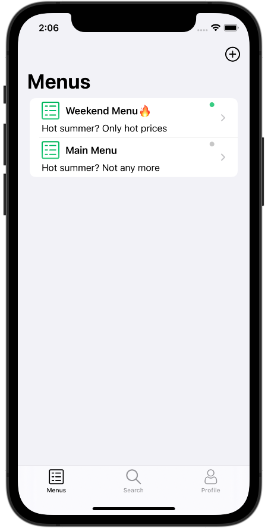</td>
    <td></td>
    <td>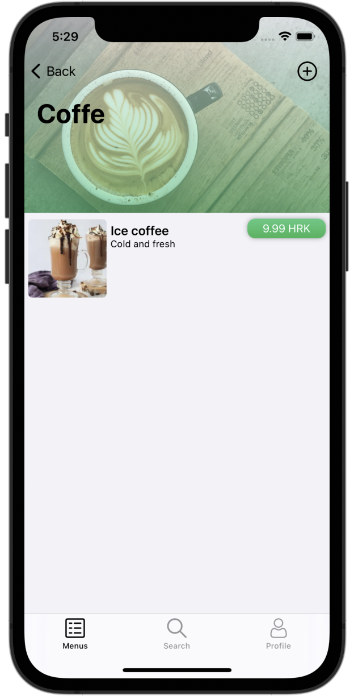</td>
  </tr>
</table>

### Ordering

<table>
  <tr>
    <td></td>
    <td></td>
    <td>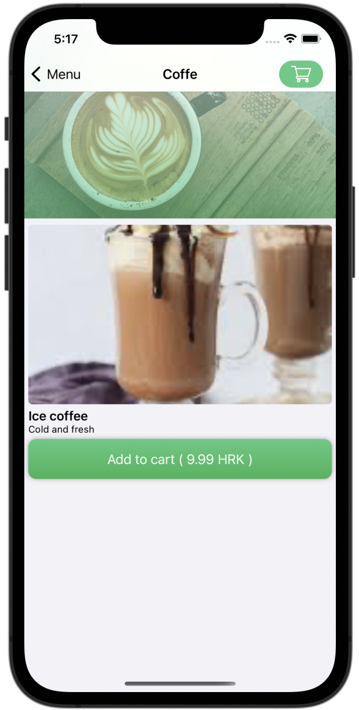</td>
  </tr>
  <tr>
    <td>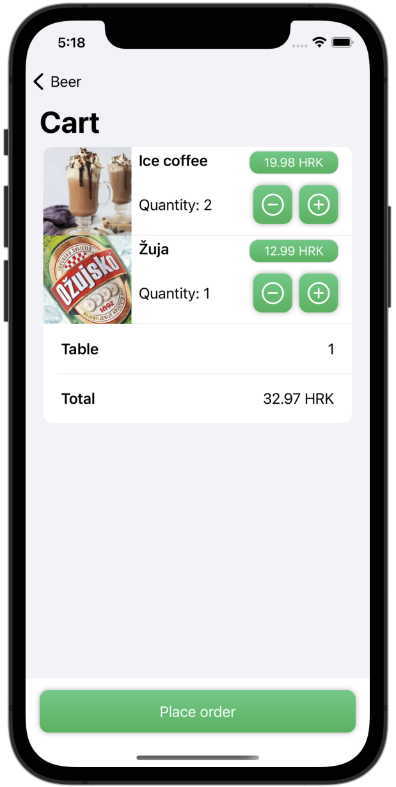</td>
    <td>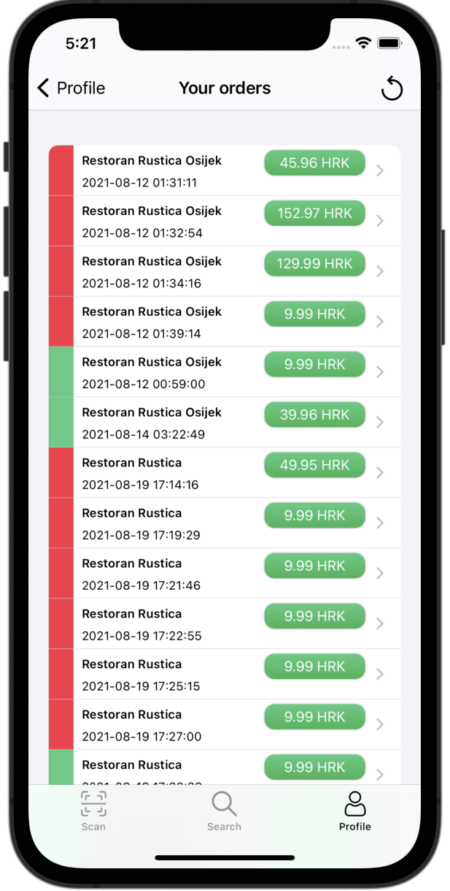</td>
  </tr>
</table>

### Search

<table>
  <tr>
    <td>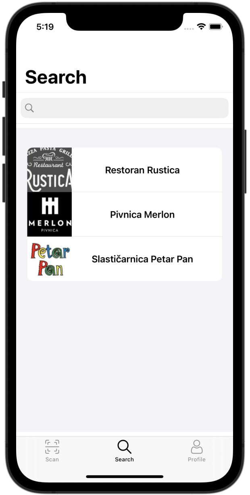</td>
    <td></td>
  </tr>
  <tr>
    <td></td>
    <td></td>
  </tr>
</table>

### Profile

<table>
  <tr>
    <td>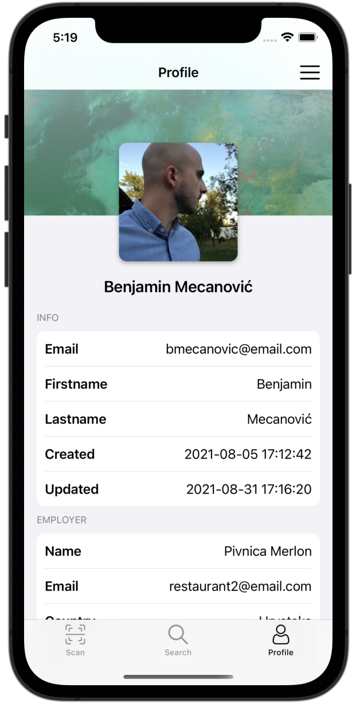</td>
    <td>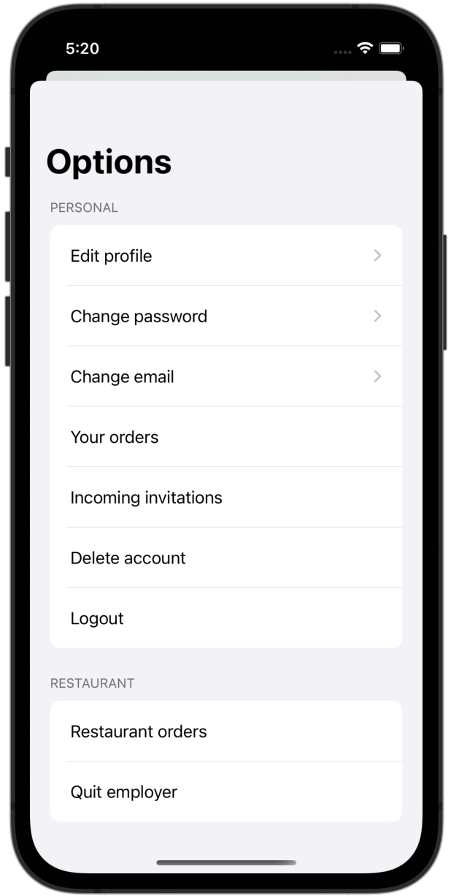</td>
  </tr>
  <tr>
    <td></td>
    <td></td>
  </tr>
</table>
